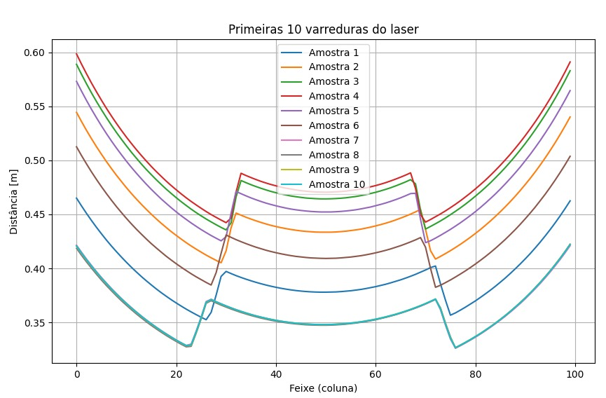

# Sensor View  

Este projeto tem como objetivo a criação de um modelo de simulação no **CoppeliaSim** para aquisição de dados de relevo da pista por meio de um **sensor laser 2D**.  
A partir dessas leituras, é possível realizar a **geração de nuvens de pontos** e o **processamento dos dados** para extração de características do terreno.  

---

### Visão geral da simulação 

---

### Aquisição e correção de dados  

O modelo no CoppeliaSim exporta os dados do sensor em formato **CSV**, como os disponíveis na pasta `data/`.

Na simulação, o sensor está configurado para pegar 100 amostras dentro do campo de visão de 120º. A taxa de amostragem dos valores não foi observada.

- Cada **linha do CSV** corresponde a uma varredura completa do sensor.  
- Cada **coluna** representa a distância medida por um feixe específico.  

No entanto, essas medidas **apresentam distorções**, já que o sensor retorna valores diretamente em coordenadas polares relativas ao robô.  

A visualização dos dados crus **sem correções** pode ser observada abaixo, gerada pelo script `sampleDataDistorted.py`:  

> python scripts/sampleDataDistorted.py data/laser_scans_full.csv

Após aplicar as **transformações polares → cartesianas** para corrigir a geometria das leituras, é possível obter representações mais fiéis do ambiente. O script `sampleDataNoDistortion.py` plota as 10 primeiras amostras **com e sem correções**, resultando em imagens como esta:  

> python scripts/sampleDataNoDistortion.py data/laser_scans_full.csv

### Geração do perfil do terreno

A superfície do terreno é obtida então pelo sequenciamento de amostras de cada linha do arquivo em um eixo paralelo. Para gerar essa visualização, foi adicionado o módulo `surfaceGen.py`. A superfície gerada é como a da imagem a seguir:

> python scripts/surfaceGen.py data/laser_scans_full.csv 

### Geração de Nuvem de Pontos

Os dados do sensor podem ser processados e exportados para um formato de nuvem de pontos para ser visualizado em softwares como o [MeshLab](https://www.meshlab.net/). Foi adicionado o módulo para converter os dados em `*.ply`. Para serem importados no MeshLab, por exemplo. 

> python scripts/pointCloudGen.py data/laser_scans_full.csv data/outputs/pointCloudSurface.ply

Uma vez processados, a nuvem de pontos pode ser importada no MeshLab:

---

### Bump Detector

## Estrutura do projeto  

- `data/` → contém os arquivos CSV exportados do CoppeliaSim e os PLY gerados a partir das leituras.  
- `scripts/` → scripts Python para conversão, visualização e geração de nuvens de pontos.  
- `sim/` → cena configurada no CoppeliaSim para execução da simulação.  

---

